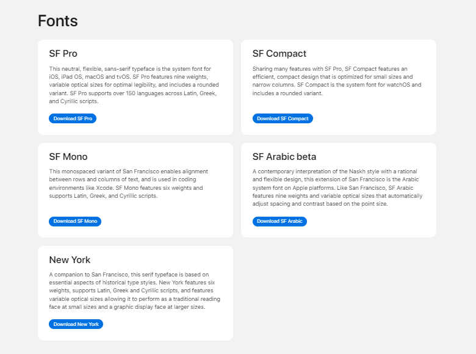
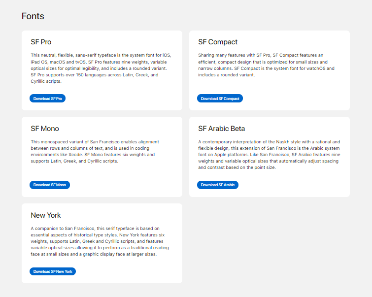

# [fonts-apple-developer](https://fap-128434.netlify.app/)
Replica of the Fonts page from the Apple Developer site.

I did this attempt of a "replica" of a section of the Fonts page from the [Apple Developer](https://developer.apple.com/fonts/) site a few months ago when I was starting to learn about CSS, and I decided to reupload it but with cleaner code. The "replica" is nothing out of this world, but how I mentioned before, I did it when I was starting.

I couldn't get the same result as the original basically due to the fonts, I didn't find the exact fonts they were using, therefore I tried to use the ones that approached the most to the design.

> **Note:** When deploying the site with the name of this repository there had been a couple of troubles basically because Google detected it as a "fraudulent site" (due to the similarity of the URL with the original), therefore the site's URL is an abbreviation (fonts-apple-developer -> fap) in order to avoid the mentioned before.

## Project's preview

### Desktop

#### Original

#### Replica
